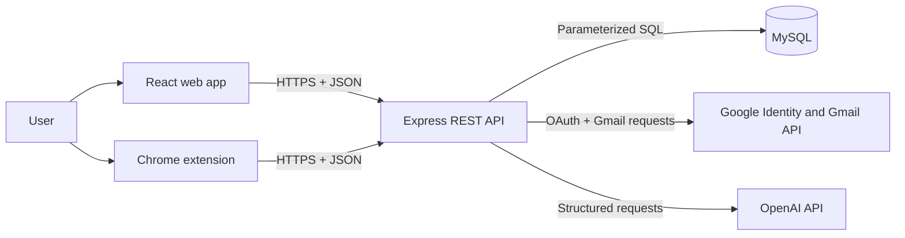
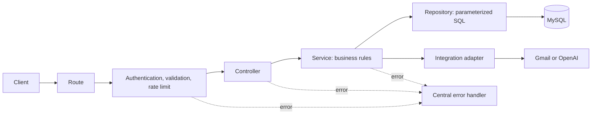
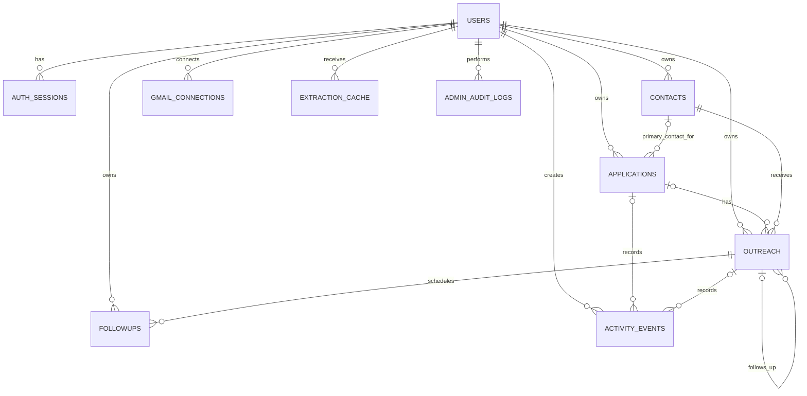

# Concourse Architecture

## 1. Product goal

Concourse is a job-application and outreach tracker that helps a user capture opportunities, send thoughtful emails, follow up, and keep the pipeline current.

The system must stay human-controlled:

- The browser extension captures data and opens an editable confirmation form.
- AI may extract, classify, or draft, but thea user can review every result.
- Gmail creates real drafts; the user may edit and send them from Gmail.
- Gmail sync confirms sent mail and replies before the tracker changes.
- Ambiguous email classifications require user confirmation.

This document locks the MVP scope. New ideas go into a later backlog unless they are required for security or correctness.

## 2. Locked MVP

The MVP contains:

1. Google account sign-in and a small user profile.
2. Applications captured manually or from the extension.
3. Contacts for founders, hiring managers, recruiters, and other decision-makers.
4. Cold outreach captured from Gmail or prepared from Concourse.
5. Gmail connection, draft creation, sent-mail confirmation, and reply sync.
6. At most two business-day follow-ups per email conversation.
7. AI-assisted extraction, short email drafting, and email classification.
8. A pipeline with a timeline of screening and interview rounds.
9. A personal dashboard based on the useful parts of the original prototype.
10. A protected admin view with aggregate usage and system health.

The MVP does not include microservices, Redis, a message broker, teams, billing, mobile apps, or a custom workflow builder.

## 3. Architecture style

Concourse uses a **modular monolith**:

- one React web client;
- one Chrome extension;
- one Express REST API;
- one MySQL database;
- Gmail and OpenAI as external integrations.

Each feature owns its route, controller, service, repository, validation, and tests. Modules may call another module through its service, but never query another module's tables through its repository.



### System rules

- Browser clients never connect directly to MySQL, Gmail, or OpenAI.
- Secrets and OAuth refresh tokens remain on the server.
- Every user-owned query includes the authenticated `user_id`.
- The server validates all client and extension input.
- AI output is treated as untrusted structured input and validated before use.
- Sending email and changing ambiguous pipeline stages require human review.
- Admin authorization is enforced by the API, not only by hiding UI controls.

## 4. Account, sign-in, and profile

### Google sign-in decision

The MVP has one `/login` page with **Continue with Google**. It does not have separate password sign-up and sign-in forms.

- The first successful Google sign-in creates the Concourse account.
- Later Google sign-ins open the existing account.
- Sign-in requests only `openid`, `email`, and `profile`.
- Google supplies a stable subject ID, verified email information, display name, and possibly an avatar.
- Google does not supply the user's resume, skills, target role, or complete professional profile.

After first sign-in, a short onboarding form asks only for:

- display name;
- timezone, initially detected by the browser;
- target roles, optional;
- skills or short professional summary, optional;
- email signature name, optional;
- default follow-up timing, prefilled with the system defaults.

The user's profile page shows and edits these fields. Email is read-only because it belongs to the connected identity. The `admin` role can only be granted by protected server-side administration.

### Gmail is connected separately

Signing in and granting mailbox access are different actions.

1. Google sign-in creates an authenticated Concourse session using minimal identity scopes.
2. In Settings, the user chooses **Connect Gmail**.
3. A separate consent flow requests only the Gmail permissions required for drafts and synchronization.
4. Disconnecting Gmail does not delete the Concourse account.

This incremental consent keeps account creation simple and prevents Concourse from asking for mailbox access before the user needs the feature.

## 5. Main user flows

### 5.1 Capture an application

1. The user opens a job or company portal.
2. The extension reads useful visible fields such as company, role, location, URL, source, salary, experience, and contact details when present.
3. The extension opens a compact editable popup.
4. The user checks or corrects the values.
5. Saving creates an application as `saved` or `applied`.
6. The tracker and dashboard update immediately.

If an application has a real human contact, it may use the shared outreach and follow-up flow. Automated company addresses do not receive follow-ups.

### 5.2 Capture cold outreach

1. The user writes a cold referral or opportunity email in Gmail.
2. The extension captures the recipient, subject, body, company, role, and contact context.
3. An editable popup lets the user correct the captured fields.
4. After the user sends the email, Gmail sync confirms the sent message.
5. Concourse stores the Gmail message/thread identifiers and marks outreach as `sent`.
6. If the outreach represents a new opportunity, an application is created or linked and moves to `applied`.
7. The two-step follow-up plan is scheduled.

### 5.3 Draft and send a follow-up

1. A due follow-up appears on the dashboard.
2. Concourse sends the relevant application, contact, conversation, and timeline context to OpenAI.
3. OpenAI returns a short, precise subject and body.
4. Concourse validates the response and displays it as `draft_ready`.
5. The user reviews or edits it.
6. **Open in Gmail** creates a Gmail draft in the correct thread.
7. The user makes any final edits and sends from Gmail.
8. Gmail sync confirms the sent message and marks the follow-up `sent`.

Concourse never treats draft creation as proof that an email was sent.

### 5.4 Sync replies and pipeline changes

1. Gmail sync searches known Gmail thread IDs first and uses stored company/contact context only when needed.
2. Concourse retrieves only messages relevant to tracked conversations.
3. Relevant sender, subject, body text, date, current stage, and recent timeline are sent to OpenAI for structured classification.
4. The result contains a category, confidence, summary, suggested stage, and extracted event details.
5. Deterministic and high-confidence events may update automatically.
6. Ambiguous results create a review item instead of changing the pipeline.
7. A reply pauses remaining follow-ups immediately.

Examples:

| Email meaning | Application result |
|---|---|
| Receipt or acknowledgement | remain `applied` |
| Recruiter screening invitation | `screening` plus timeline event |
| Interview invitation | `interviewing` plus a new round event |
| Next-round invitation | remain `interviewing`; append another round |
| Offer | `offered`; stop follow-ups |
| Rejection | `rejected`; stop follow-ups and record reason |
| Unclear message | require user review |

AI cannot guarantee perfect interpretation. Concourse provides accuracy through source-linked suggestions, confidence thresholds, validation, and human review.

## 6. Pipeline and timeline

Application stages are:

```text
saved -> applied -> screening -> interviewing -> offered
                                      |-> rejected
                                      |-> ghosted
                                      |-> withdrawn
```

`offered`, `rejected`, `ghosted`, and `withdrawn` are terminal stages and stop all follow-ups.

Interview rounds do not become extra application statuses. While the application remains `interviewing`, timeline events stack underneath it:

- round number;
- round type;
- scheduled date;
- short description extracted from the email;
- result or user review;
- linked Gmail message.

Rejected applications store the reason and optional learning notes. Offered applications show a concise success story: applied date, first response, rounds, offer date, and total days to offer.

## 7. Follow-up strategy

Every tracked email conversation can have **at most two sequential follow-ups**. Follow-up 2 is scheduled only after follow-up 1 is confirmed sent.

### Application with a human contact

- Follow-up 1: 5 business days after the initial email.
- Follow-up 2: 7 business days after follow-up 1 is sent.
- Ghosted: 7 business days after follow-up 2 is sent with no meaningful reply.

### Cold outreach

- Follow-up 1: 3 business days after the initial email.
- Follow-up 2: 5 business days after follow-up 1 is sent.
- Ghosted: 5 business days after follow-up 2 is sent with no meaningful reply.

### Scheduling rules

- Saturday and Sunday do not count as business days.
- Company holidays are deferred until a later version.
- A promised response date overrides the default schedule.
- Any meaningful reply pauses the plan.
- A terminal application stage cancels pending follow-ups.
- An automated sender, missing contact, unsubscribe request, or bounced address skips follow-ups.
- The user may pause, reschedule, skip, edit, or cancel any follow-up.
- A scheduled task may mark items due and run Gmail sync, but it never sends mail without the user.

## 8. Dashboard

The personal dashboard keeps the useful visual ideas from the prototype while using real data.

### Top summary cards

- active applications;
- total applications tracked;
- outreach response rate;
- follow-ups due;
- ghosted opportunities.

### Main sections

1. **Pipeline by stage**: counts for saved, applied, screening, interviewing, offered, rejected, ghosted, and withdrawn.
2. **Activity heatmap**: a cream-and-green calendar using application dates and outreach sent dates.
3. **Activity statistics**: current streak, maximum streak, active days, and total tracked activity.
4. **Source performance**: applications, replies, interviews, and offers grouped by source.
5. **Action lists**: Recent Activity, Follow-ups Due, and Needs Review/Ghosted.

The heatmap tooltip shows the date plus an application/outreach breakdown. The dashboard does not restore the old Cold Outreach Funnel.

### Admin dashboard

The admin dashboard is a separate protected route. It contains aggregate operational data:

- total, active, suspended, and newly registered users;
- applications and outreach volume;
- Gmail connection and sync health;
- due or failed background work;
- API error rate and latency;
- AI usage and failures;
- audit history for admin actions.

An admin may inspect a user's records only for support or safety with an explicit reason. Every such action is audited. Normal analytics should use aggregate counts and avoid exposing email bodies.

## 9. Backend structure

```text
server/
  app.js
  index.js
  config/
  db/
    connection.js
    schema.sql
  middleware/
  shared/
    errors/
    logging/
    validation/
  modules/
    auth/
    profile/
    applications/
    contacts/
    outreach/
    followups/
    gmail/
    activity/
    dashboard/
    extraction/
    admin/
```

Request flow:



- **Route:** maps method and URL.
- **Middleware:** authenticates, validates, limits, and attaches request IDs.
- **Controller:** reads HTTP input and sends HTTP output.
- **Service:** owns business rules and cross-module coordination.
- **Repository:** runs parameterized SQL and maps database rows.
- **Integration adapter:** isolates Gmail and OpenAI SDK/API details.
- **Error handler:** returns one safe API error shape.

Controllers never contain SQL. Repositories never decide business policy. External API calls are never placed directly in routes.

## 10. Module ownership

| Module | Owns | Responsibility |
|---|---|---|
| `auth` | `users`, `auth_sessions` | Google identity, app sessions, logout, revocation |
| `profile` | profile fields in `users` | onboarding and preferences |
| `applications` | `applications` | capture, lifecycle, ownership, duplicate protection |
| `contacts` | `contacts` | reusable people and confirmed contact details |
| `outreach` | `outreach` | email review, Gmail identifiers, send/reply lifecycle |
| `followups` | `followups` | two-step scheduling, pause, due, complete, skip |
| `gmail` | `gmail_connections` | OAuth tokens, drafts, history sync, disconnect |
| `activity` | `activity_events` | append-only application/outreach timeline |
| `dashboard` | none | read-only personal aggregates |
| `extraction` | `extraction_cache` | extraction/classification provenance and short-lived cache |
| `admin` | `admin_audit_logs` | protected aggregate operations and audit trail |

## 11. Conceptual data model



All user-owned tables include `user_id`. Services verify that linked application, contact, outreach, and follow-up records belong to the same user.

## 12. Table design

### `users`

Stores Google identity, profile, authorization, and preferences.

Important columns: `id`, `google_subject`, `email`, `display_name`, `avatar_url`, `timezone`, `target_roles`, `skills_summary`, `signature_name`, `role`, `status`, `last_login_at`, `created_at`, `updated_at`.

- `google_subject` and normalized `email` are unique.
- `role` is `member` or `admin` and defaults to `member`.
- `status` is `active`, `suspended`, or `deactivated`.

### `auth_sessions`

Stores revocable Concourse sessions: `id`, `user_id`, `session_token_hash`, `user_agent`, `expires_at`, `last_used_at`, `revoked_at`, `created_at`.

Only a SHA-256 hash of the random session token is stored. A session is valid only while unexpired, unrevoked, and attached to an active user.

### `applications`

Important columns: `id`, `user_id`, `primary_contact_id`, `company_name`, `job_title`, `job_url`, `job_url_hash`, `location`, `source`, `salary_range`, `experience`, `resume_label`, `status`, `applied_at`, `offered_at`, `rejection_reason`, `notes`, `created_at`, `updated_at`.

Important indexes: `(user_id, status)`, `(user_id, created_at)`, `(user_id, applied_at)`, and duplicate detection using `(user_id, job_url_hash)` when a URL exists.

### `contacts`

Important columns: `id`, `user_id`, `full_name`, `email`, `phone`, `company_name`, `job_title`, `profile_url`, `source`, `source_url`, `confirmed_at`, `notes`, `archived_at`, `created_at`, `updated_at`.

An extension-captured email remains unconfirmed until the user reviews it. Frequently used indexes are `(user_id, email)` and `(user_id, company_name)`.

### `outreach`

Represents an initial message or a later message in the same conversation.

Important columns: `id`, `user_id`, `application_id`, `contact_id`, `gmail_connection_id`, `parent_outreach_id`, `recipient_email`, `subject`, `body_text`, `source`, `status`, `gmail_draft_id`, `gmail_message_id`, `gmail_thread_id`, `reviewed_at`, `sent_at`, `replied_at`, `created_at`, `updated_at`.

- `application_id` is optional so pure networking outreach is possible.
- `parent_outreach_id` links follow-up messages to the original conversation.
- Gmail identifiers are unique within the connected account where applicable.

### `followups`

Important columns: `id`, `user_id`, `outreach_id`, `sequence_number`, `due_at`, `status`, `generated_outreach_id`, `completed_at`, `skipped_reason`, `created_at`, `updated_at`.

- Unique `(outreach_id, sequence_number)`.
- `sequence_number` is restricted to `1` or `2`.
- Status values: `scheduled`, `due`, `draft_ready`, `gmail_draft`, `sent`, `paused`, `completed`, `skipped`, `cancelled`.

### `gmail_connections`

Important columns: `id`, `user_id`, `gmail_address`, `encrypted_refresh_token`, `granted_scopes`, `history_id`, `sync_status`, `last_synced_at`, `last_error_code`, `revoked_at`, `created_at`, `updated_at`.

Refresh tokens are encrypted at rest and never returned by the API.

### `activity_events`

Stores the application and outreach timeline: `id`, `user_id`, `application_id`, `outreach_id`, `event_type`, `title`, `summary`, `occurred_at`, `gmail_message_id`, `metadata_json`, `created_by`, `created_at`.

Interview rounds use `event_type = interview_round` and store round number/type in validated JSON. This avoids another table during the MVP.

### `extraction_cache`

Stores short-lived, source-linked AI results: `id`, `user_id`, `operation`, `input_hash`, `result_json`, `model`, `confidence`, `expires_at`, `created_at`.

It is a cache and audit aid, not the authoritative tracker state.

### `admin_audit_logs`

Stores `id`, `admin_user_id`, `action`, `target_user_id`, `reason`, `metadata_json`, `ip_address`, and `created_at`. It is append-only.

## 13. REST API

All endpoints use `/api`, JSON, authenticated ownership checks, and a consistent response shape.

### Authentication and profile

```text
GET    /api/auth/google
GET    /api/auth/google/callback
GET    /api/auth/session
POST   /api/auth/logout
GET    /api/profile
PATCH  /api/profile
```

### Applications and contacts

```text
GET    /api/applications
POST   /api/applications
GET    /api/applications/:id
PATCH  /api/applications/:id
DELETE /api/applications/:id
GET    /api/applications/:id/activity

GET    /api/contacts
POST   /api/contacts
PATCH  /api/contacts/:id
DELETE /api/contacts/:id
```

### Outreach and follow-ups

```text
GET    /api/outreach
POST   /api/outreach
GET    /api/outreach/:id
PATCH  /api/outreach/:id
POST   /api/outreach/:id/review
POST   /api/outreach/:id/gmail-draft

GET    /api/followups?state=due
POST   /api/followups/:id/generate-draft
PATCH  /api/followups/:id
POST   /api/followups/:id/gmail-draft
```

### Gmail, dashboard, and admin

```text
GET    /api/gmail/connect
GET    /api/gmail/callback
GET    /api/gmail/status
POST   /api/gmail/sync
DELETE /api/gmail/connection

GET    /api/dashboard/summary
GET    /api/dashboard/activity
GET    /api/dashboard/actions

GET    /api/admin/summary
GET    /api/admin/system-health
GET    /api/admin/audit-logs
```

List endpoints use cursor pagination with a maximum page size of 100. Filters are explicit and allowlisted.

## 14. Gmail and OpenAI boundaries

### Gmail adapter

The Gmail adapter owns OAuth, token refresh, draft creation, relevant thread lookup, sent confirmation, and reply synchronization. Services use internal methods and do not depend on Google response shapes.

Sync is idempotent: processing the same Gmail message twice must not create duplicate outreach or timeline events.

### OpenAI adapter

The OpenAI adapter supports three operations:

1. extract structured job/contact data;
2. draft a short contextual email;
3. classify a relevant email and extract an event.

Every operation uses a strict JSON schema. The server validates allowed statuses, required fields, confidence, and ownership before saving anything. Prompts contain only the minimum relevant context and never include OAuth tokens, session tokens, or unrelated mailbox content.

## 15. Security, privacy, and reliability

- Use secure, `HttpOnly`, `SameSite=Lax` session cookies in production.
- Validate OAuth `state`, redirect URIs, token issuer, audience, signature, and expiry.
- Protect cookie-authenticated state-changing routes against CSRF.
- Use an exact production CORS allowlist.
- Use `helmet`, body-size limits, and input schemas.
- Use parameterized SQL for every value.
- Encrypt Gmail refresh tokens and rotate the encryption key through a controlled process.
- Redact tokens, email bodies, and sensitive profile data from logs.
- Store only mailbox messages connected to tracked work.
- Let users disconnect Gmail and delete their account/data.
- Do not use captured company or contact data for unrelated purposes.
- Record admin access in append-only audit logs.
- Keep database backups and test restore before production.

## 16. Rate limiting and fast responses

Starting limits are configuration, not hard-coded policy:

| Area | Initial limit |
|---|---:|
| General API | 120 requests/minute per user; IP fallback |
| Login and OAuth start | 10 attempts/15 minutes per IP |
| AI generation/classification | 10 requests/minute per user |
| Manual Gmail sync | 6 requests/minute per user |
| Admin routes | 60 requests/minute per admin |

Return `429` with `Retry-After`. Successful read requests should normally finish within 300 ms excluding Gmail/OpenAI calls.

Performance rules:

- use a MySQL connection pool;
- select only needed columns;
- paginate lists;
- add indexes for measured query patterns;
- compute dashboard aggregates with SQL;
- cache only short-lived extraction or expensive dashboard results;
- set timeouts and bounded retries for Gmail and OpenAI;
- return quickly from sync-start endpoints and show progress in the UI.

The first implementation may run the small scheduled sync worker in the same deployment. Move it to a separate worker process before horizontal scaling. Add Redis or a durable queue only when real traffic, retries, or multi-instance scheduling require it.

## 17. API response and error format

Success:

```json
{
  "data": {},
  "meta": { "requestId": "..." }
}
```

Failure:

```json
{
  "error": {
    "code": "VALIDATION_ERROR",
    "message": "Check the highlighted fields.",
    "fields": {}
  },
  "meta": { "requestId": "..." }
}
```

Expected status codes: `200`, `201`, `204`, `400`, `401`, `403`, `404`, `409`, `422`, `429`, and `500`. Internal stack traces never reach clients.

## 18. Testing strategy

Tests protect meaningful behavior:

- repository tests for ownership filters and important SQL constraints;
- service tests for pipeline transitions, two-follow-up maximum, business-day dates, reply pause, and terminal cancellation;
- API tests for authentication, validation, and authorization;
- Gmail adapter tests with saved fixtures and idempotent sync cases;
- OpenAI adapter tests for valid, invalid, low-confidence, and ambiguous structured results;
- one end-to-end path: Google login -> capture application -> create outreach -> follow-up draft -> Gmail sync -> pipeline update.

Manual checks remain useful while learning, but repeatable tests are added when a business rule can silently break.

## 19. Build order

Build vertical slices so every phase produces something visible:

1. **Foundation complete:** Express health endpoint, MySQL connection, initial applications table.
2. **Applications API:** list, create, read, update, delete, validation, and test data.
3. **Applications UI:** tracker list, form, stage update, and application detail timeline.
4. **Google account:** login, session, logout, onboarding, and profile page.
5. **Extension capture:** editable popup that creates an application.
6. **Contacts and outreach:** contact CRUD and editable cold-email capture.
7. **Gmail connection:** separate consent, draft creation, sent confirmation, and reply sync.
8. **Follow-ups:** business-day scheduling, maximum two, AI draft, Gmail draft, and reply cancellation.
9. **Pipeline intelligence:** email classification, review queue, and interview-round timeline.
10. **Dashboard:** cards, pipeline, heatmap, streaks, source performance, and action lists.
11. **Admin and hardening:** aggregate dashboard, audit logs, rate limits, security review, tests, and deployment.

Finish and verify one step before starting the next. The immediate next step is the Applications API.

## 20. Definition of done

The MVP is complete when one user can:

- sign in with Google and maintain a profile;
- capture and correct a job from the extension;
- view and update it in the tracker;
- capture or prepare cold outreach;
- connect Gmail separately;
- review a generated follow-up and open it as a Gmail draft;
- send from Gmail and see Concourse confirm it;
- receive a reply and see a source-linked pipeline suggestion or update;
- track multiple interview rounds in one timeline;
- see accurate dashboard statistics;
- stop correctly at offered, rejected, ghosted, or withdrawn;
- trust that another user cannot access their data.

An admin can see aggregate usage and system health without casually reading private mailbox content.

## 21. Future extension points

After real usage proves the need, Concourse may add teams, subscriptions, custom holidays, push-based Gmail notifications, a separate worker/queue, Redis caching, richer admin support tools, and more OAuth providers. The current module and ownership boundaries allow these additions without rewriting the core application.

## 22. Reference decisions

- Google account identity uses OpenID Connect with minimal `openid email profile` scopes.
- Gmail authorization uses the narrowest scopes that support the chosen draft and synchronization operations.
- Restricted Gmail scopes may require Google verification and, when restricted data is stored or transmitted by a public app, an additional security assessment. This must be reviewed before public launch.
